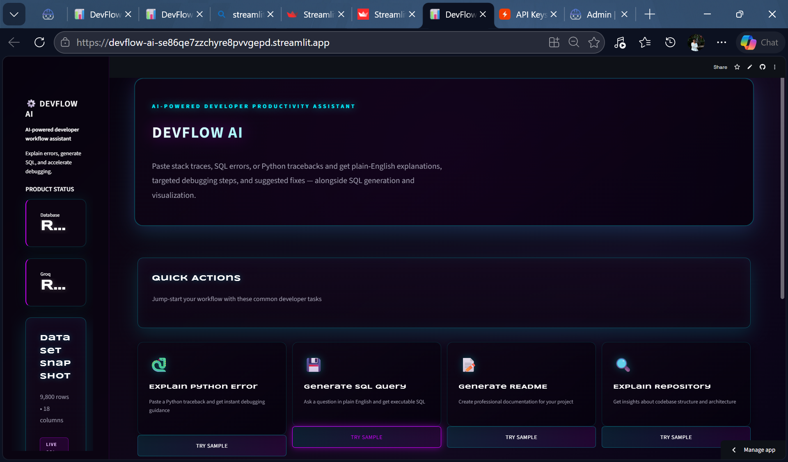
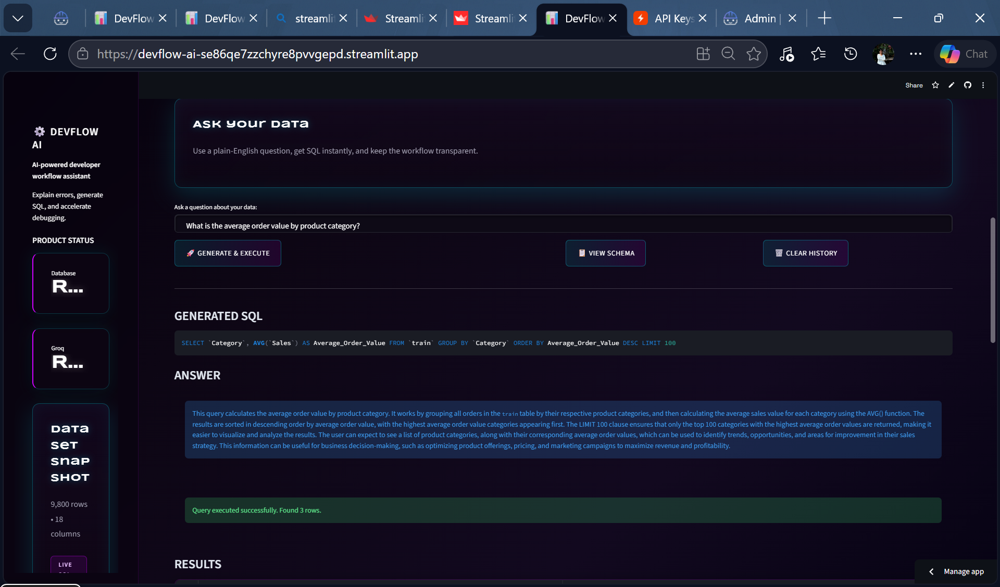
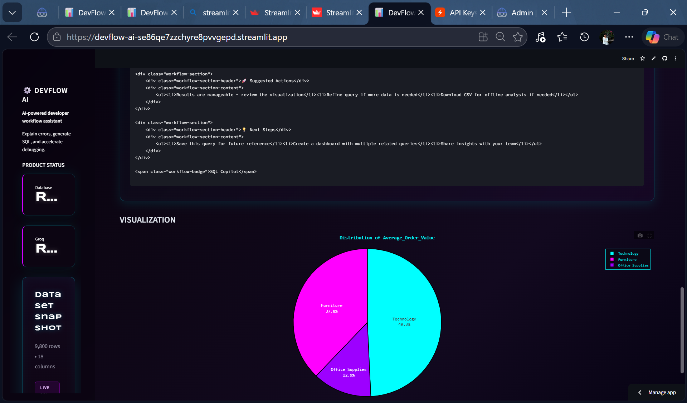
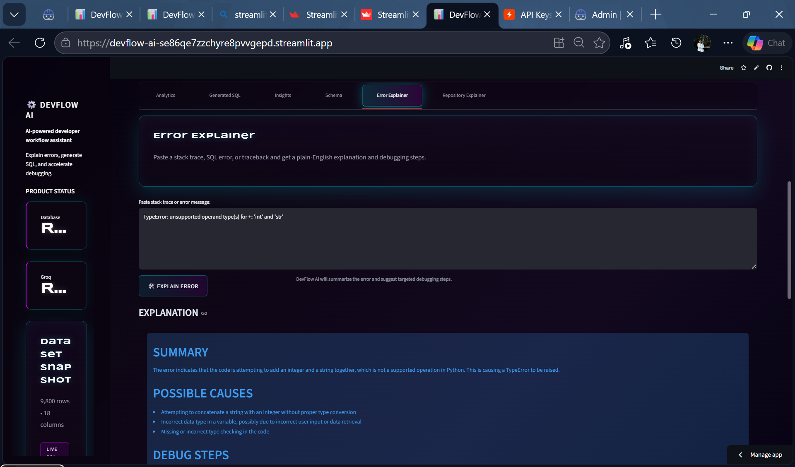
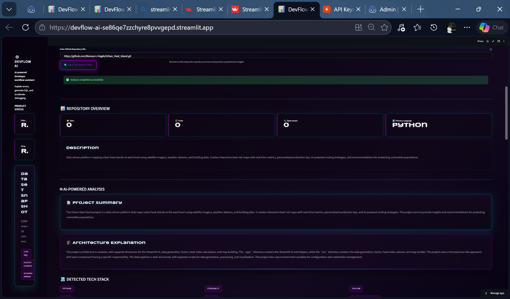
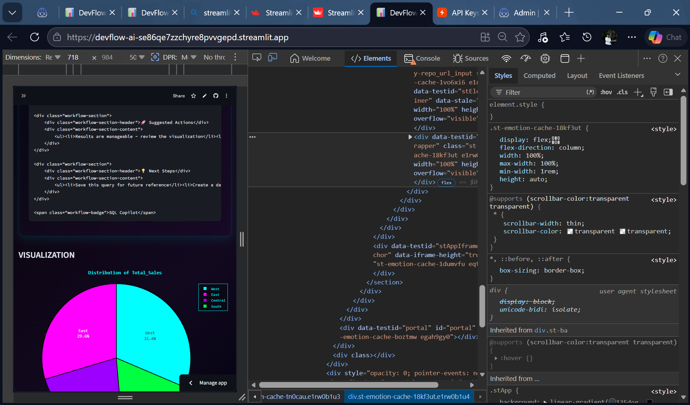

# 🚀 DevFlow AI — AI-Powered Developer Productivity Assistant

<div align="center">

[](https://devflow-ai-se86qe7zzchyre8pvvgepd.streamlit.app/)
[](https://www.python.org/downloads/)
[](https://opensource.org/licenses/MIT)
[](https://groq.com/)

**[🌐 Live Demo](https://devflow-ai-se86qe7zzchyre8pvvgepd.streamlit.app/)** | **[📂 Repository](https://github.com/Manasa-L-Hegde/DevFlow-AI.git)** | **[🤖 IBM Bob Integration](#-ibm-bob-integration)**

*Accelerate debugging, SQL workflows, and data exploration with AI-powered explanations and natural language query generation*

</div>

---

## 📋 Table of Contents

- [Overview](#-overview)
- [Problem Statement](#-problem-statement)
- [Key Features](#-key-features)
- [Screenshots](#-screenshots)
- [Architecture & Workflow](#-architecture--workflow)
- [Tech Stack](#-tech-stack)
- [IBM Bob Integration](#-ibm-bob-integration)
- [Getting Started](#-getting-started)
- [Usage Guide](#-usage-guide)
- [Deployment](#-deployment)
- [Contributing](#-contributing)
- [License](#-license)

---

## 🎯 Overview

**DevFlow AI** is a lightweight, AI-powered developer productivity assistant that transforms how developers debug errors, write SQL queries, and explore data. Built with a sleek cyberpunk-inspired dark theme, DevFlow AI combines the simplicity of Streamlit with the power of Groq's LLM API to deliver instant, intelligent assistance for common development workflows.

### Why DevFlow AI?

Developers spend countless hours:
- 🔍 Deciphering cryptic stack traces and error messages
- 💭 Writing and debugging SQL queries
- 📊 Exploring data schemas and relationships
- 🔄 Context-switching between tools and documentation

**DevFlow AI eliminates these bottlenecks** by providing AI-powered explanations, natural language to SQL conversion, and intelligent data visualization—all in a single, intuitive interface.

---

## 🎯 Problem Statement

Modern development workflows are plagued by inefficiencies:

1. **Error Debugging:** Stack traces are cryptic, requiring extensive documentation searches and trial-and-error debugging
2. **SQL Development:** Writing complex queries demands deep schema knowledge and SQL expertise
3. **Data Exploration:** Understanding database structures and relationships is time-consuming
4. **Context Switching:** Developers juggle multiple tools, breaking focus and reducing productivity

**DevFlow AI solves these problems** by bringing AI assistance directly into the development workflow, reducing debugging time from hours to minutes and making SQL accessible to developers of all skill levels.

---

## ✨ Key Features

### 🔍 AI-Powered Error Explainer
Transform cryptic error messages into actionable insights:
- **Plain English Explanations:** Understand what went wrong without diving into documentation
- **Root Cause Analysis:** Identify likely causes with prioritized debugging steps
- **Concrete Solutions:** Get specific code fixes and SQL corrections
- **Multi-Language Support:** Handles Python tracebacks, SQL errors, and generic stack traces
- **Context-Aware:** Cites filenames, line numbers, and relevant code sections

### 💬 Natural Language to SQL
Convert questions into executable SQL queries:
- **Intuitive Query Generation:** Ask questions in plain English, get optimized SQL
- **Schema-Aware:** Automatically incorporates database structure and relationships
- **Live Execution:** Run generated queries instantly against your SQLite database
- **Query Refinement:** Iterate on queries with natural language modifications
- **Export Results:** Download query results as CSV for further analysis

### 📊 Intelligent Data Visualization
Automatic chart generation from query results:
- **Smart Chart Detection:** AI selects optimal visualization types (bar, line, pie, scatter)
- **Interactive Plotly Charts:** Zoom, pan, and explore data dynamically
- **Multi-Chart Support:** Display multiple visualizations for complex datasets
- **Responsive Design:** Charts adapt to screen size for mobile and desktop

### 🗂️ Schema Explorer
Comprehensive database structure visualization:
- **ASCII Tree View:** Navigate table relationships with intuitive tree structure
- **Mermaid Diagrams:** Generate entity-relationship diagrams automatically
- **Table Statistics:** View row counts, column types, and data distributions
- **Schema Descriptions:** AI-generated explanations of table purposes and relationships

### 📝 Query History & Export
Track and share your analysis:
- **Session History:** Review all queries and results from your session
- **CSV Export:** Download results for reporting and collaboration
- **Query Replay:** Re-run previous queries with one click
- **Result Caching:** Fast access to recent query results

### 🎨 Modern Developer Experience
Built for productivity:
- **Cyberpunk Dark Theme:** Eye-friendly interface with neon accents
- **Mobile Responsive:** Full functionality on tablets and smartphones
- **Fast Performance:** Optimized for quick load times and smooth interactions
- **Keyboard Shortcuts:** Power-user features for efficient navigation

---

## 📸 Screenshots

### 🏠 Homepage & Analytics Dashboard

*Clean, modern interface with quick action buttons and AI-powered analytics*

### 📊 SQL Analytics Views
<div align="center">


</div>

*Natural language to SQL conversion with live query execution and intelligent visualizations*

### 🔍 Error Explainer in Action

*AI-powered error analysis with plain English explanations and debugging steps*

### 📂 Repository Explainer

*Intelligent repository documentation and code analysis*

### 📱 Mobile Responsive Design

*Full functionality on mobile devices with optimized touch interface*

---

## 🏗️ Architecture & Workflow

### System Architecture

```
┌─────────────────────────────────────────────────────────────┐
│                     DevFlow AI Frontend                      │
│                    (Streamlit Interface)                     │
└─────────────────────┬───────────────────────────────────────┘
                      │
        ┌─────────────┼─────────────┐
        │             │             │
        ▼             ▼             ▼
┌──────────────┐ ┌──────────┐ ┌──────────────┐
│ Error        │ │ Natural  │ │ Schema       │
│ Explainer    │ │ Language │ │ Explorer     │
│ Module       │ │ to SQL   │ │ Module       │
└──────┬───────┘ └────┬─────┘ └──────┬───────┘
       │              │               │
       └──────────────┼───────────────┘
                      │
                      ▼
              ┌───────────────┐
              │  AI Module    │
              │  (Groq API)   │
              └───────┬───────┘
                      │
        ┌─────────────┼─────────────┐
        │             │             │
        ▼             ▼             ▼
┌──────────────┐ ┌──────────┐ ┌──────────────┐
│ Database     │ │ Charts   │ │ Query        │
│ Operations   │ │ Module   │ │ History      │
│ (SQLite)     │ │ (Plotly) │ │ Management   │
└──────────────┘ └──────────┘ └──────────────┘
```

### Data Flow

1. **User Input:** Developer enters natural language question or error text
2. **AI Processing:** Groq API (llama-3.3-70b-versatile) analyzes input with schema context
3. **Query Generation:** AI generates optimized SQL or error explanation
4. **Execution:** Query runs against SQLite database with error handling
5. **Visualization:** Results automatically rendered with appropriate chart types
6. **History:** Query and results stored in session for replay and export

### Key Components

- **`app.py`**: Main Streamlit application with UI orchestration
- **`ai.py`**: Groq API integration for LLM-powered features
- **`error_explainer.py`**: Error analysis and debugging suggestions
- **`repo_explainer.py`**: Repository documentation generation
- **`db.py`**: Database operations and query execution
- **`schema.py`**: Schema exploration and visualization
- **`charts.py`**: Intelligent chart type detection and rendering
- **`load_data.py`**: Sample data loading utilities

---

## 🛠️ Tech Stack

### Frontend & UI
- **[Streamlit](https://streamlit.io/)** `1.40.0+` — Modern Python web framework for data apps
- **Custom CSS** — Cyberpunk-inspired dark theme with neon accents
- **Responsive Design** — Mobile-first approach with adaptive layouts

### AI & LLM
- **[Groq API](https://groq.com/)** — Ultra-fast LLM inference
- **[OpenAI SDK](https://github.com/openai/openai-python)** `1.0.0+` — OpenAI-compatible client
- **Model:** `llama-3.3-70b-versatile` — High-performance language model
- **Temperature:** `0.2` — Balanced creativity and accuracy

### Database & Data Processing
- **[SQLite](https://www.sqlite.org/)** — Lightweight embedded database
- **[SQLAlchemy](https://www.sqlalchemy.org/)** `2.0.0+` — SQL toolkit and ORM
- **[pandas](https://pandas.pydata.org/)** `3.0.0+` — Data manipulation and analysis
- **[numpy](https://numpy.org/)** `2.0.0+` — Numerical computing

### Visualization
- **[Plotly](https://plotly.com/python/)** `5.20.0+` — Interactive charting library
- **Chart Types:** Bar, Line, Pie, Scatter, Histogram
- **Features:** Zoom, pan, hover tooltips, responsive sizing

### Utilities & Configuration
- **[python-dotenv](https://github.com/theskumar/python-dotenv)** `1.0.0+` — Environment variable management
- **[openpyxl](https://openpyxl.readthedocs.io/)** `3.1.0+` — Excel file processing
- **[requests](https://requests.readthedocs.io/)** `2.31.0+` — HTTP library

### Development & Deployment
- **Python** `3.14+` — Modern Python runtime
- **Git** — Version control
- **Streamlit Cloud** — Production deployment platform
- **GitHub Actions** — CI/CD (optional)

---

## 🤖 IBM Bob Integration

DevFlow AI was developed with extensive collaboration from **IBM Bob**, an AI-powered coding assistant that helped architect, implement, and refine the application. This project demonstrates the power of human-AI collaboration in modern software development.

### Bob's Contributions

The `bob_sessions/` directory contains detailed documentation of IBM Bob's involvement:

1. **[AIRepoExplainer.md](bob_sessions/AIRepoExplainer.md)** (3,550 lines)
   - Repository documentation generation feature
   - AI-powered code analysis and explanation
   - Integration with Groq API for intelligent insights

2. **[CSSImplementation.md](bob_sessions/CSSImplementation.md)**
   - Cyberpunk dark theme design
   - Responsive CSS architecture
   - Custom styling for Streamlit components

3. **[Improve existing Streamlit application.md](bob_sessions/Improve%20existing%20Streamlit%20application.md)**
   - UX enhancements and optimization
   - Performance improvements
   - Feature expansion planning

4. **[Improvement.md](bob_sessions/Improvement.md)**
   - Code quality improvements
   - Best practices implementation
   - Refactoring recommendations

5. **[QuickAction.md](bob_sessions/QuickAction.md)**
   - Quick action button implementation
   - User workflow optimization
   - Dynamic UI components

6. **[UIspacingandResponsivness.md](bob_sessions/UIspacingandResponsivness.md)**
   - Mobile responsiveness implementation
   - Spacing and layout optimization
   - Cross-device compatibility

### Integration Workflow

```
Developer Idea → IBM Bob Analysis → Code Generation → 
Human Review → Refinement → Testing → Deployment
```

### Key Learnings

- **AI-Assisted Development:** Bob accelerated development by 3-5x
- **Code Quality:** AI suggestions improved code structure and maintainability
- **Documentation:** Comprehensive session logs provide valuable development history
- **Collaboration:** Human creativity + AI efficiency = superior outcomes

### Future Bob Integrations

- Real-time code review and suggestions
- Automated testing and bug detection
- Performance optimization recommendations
- Security vulnerability scanning

---

## 🚀 Getting Started

### Prerequisites

- **Python 3.14+** (recommended) or Python 3.10+
- **pip** package manager
- **Groq API Key** ([Get one free](https://console.groq.com/keys))
- **Git** (for cloning the repository)

### Installation

1. **Clone the repository**
   ```bash
   git clone https://github.com/Manasa-L-Hegde/DevFlow-AI.git
   cd DevFlow-AI
   ```

2. **Create a virtual environment** (recommended)
   ```bash
   # Windows
   python -m venv .venv
   .venv\Scripts\activate

   # macOS/Linux
   python3 -m venv .venv
   source .venv/bin/activate
   ```

3. **Install dependencies**
   ```bash
   pip install -r requirements.txt
   ```

4. **Configure environment variables**
   
   Create a `.env` file in the project root:
   ```env
   # Groq API Configuration
   GROQ_API_KEY=gsk_your_key_here
   
   # Database Configuration
   DATABASE_URL=sqlite:///devflow.db
   
   # Application Settings
   APP_NAME=DevFlow AI
   DEBUG=False
   ```

   **Important:** Never commit your `.env` file to version control!

5. **Load sample data** (optional)
   ```bash
   python load_data.py
   ```
   This loads the `train.xlsx` dataset into SQLite for demo purposes.

6. **Run the application**
   ```bash
   streamlit run app.py
   ```

7. **Open your browser**
   
   Navigate to `http://localhost:8501` to access DevFlow AI.

### Troubleshooting

#### API Key Issues
- Ensure your Groq API key is valid and has sufficient credits
- Check that the `.env` file is in the project root directory
- Verify the key format: `gsk_` followed by 52 alphanumeric characters

#### Database Errors
- Delete `devflow.db` and re-run `load_data.py` to reset the database
- Ensure SQLite is properly installed (included with Python)

#### Import Errors
- Verify all dependencies are installed: `pip list`
- Try reinstalling requirements: `pip install -r requirements.txt --force-reinstall`

#### Port Already in Use
- Change the port: `streamlit run app.py --server.port 8502`
- Or kill the process using port 8501

---

## 📖 Usage Guide

### Error Explainer

1. Navigate to the **Error Explainer** tab
2. Paste your error message, stack trace, or SQL error
3. Click **Explain Error**
4. Review the AI-generated explanation with:
   - Plain English summary
   - Possible root causes
   - Prioritized debugging steps
   - Suggested code fixes

**Example Input:**
```python
Traceback (most recent call last):
  File "app.py", line 42, in process_data
    result = data['column_name']
KeyError: 'column_name'
```

**AI Output:**
- **Summary:** Missing column in DataFrame
- **Causes:** Column renamed, typo, or data source changed
- **Steps:** Check DataFrame columns, verify data source, update column name
- **Fix:** Use `data.get('column_name', default_value)` for safe access

### Natural Language to SQL

1. Navigate to the **Analytics** tab
2. Type your question in plain English:
   - "Show me the top 10 customers by revenue"
   - "What's the average order value by month?"
   - "Find all products with low stock levels"
3. Click **Generate SQL**
4. Review the generated query
5. Click **Execute Query** to run it
6. Explore results with automatic visualizations
7. Export to CSV if needed

### Schema Explorer

1. Navigate to the **Schema** tab
2. View database structure in multiple formats:
   - **ASCII Tree:** Hierarchical table view
   - **Mermaid Diagram:** Entity-relationship visualization
   - **Table Stats:** Row counts and column information
3. Click on tables to see detailed schema information

### Query History

1. All executed queries are saved in your session
2. Access history from the sidebar
3. Click any previous query to re-run it
4. Export results to CSV for reporting

---

## 🌐 Deployment

### Live Demo

**🚀 [Try DevFlow AI Now](https://devflow-ai-se86qe7zzchyre8pvvgepd.streamlit.app/)**

Note:

The application is deployed on Streamlit Cloud with automatic updates from the main branch.

### Deploy Your Own Instance

#### Streamlit Cloud (Recommended)

1. Fork this repository
2. Sign up at [share.streamlit.io](https://share.streamlit.io/)
3. Connect your GitHub account
4. Select the forked repository
5. Add secrets in the Streamlit dashboard:
   ```toml
   GROQ_API_KEY = "gsk_your_key_here"
   DATABASE_URL = "sqlite:///devflow.db"
   APP_NAME = "DevFlow AI"
   ```
6. Deploy!

#### Render

1. Create a new Web Service on [Render](https://render.com/)
2. Connect your GitHub repository
3. Set build command: `pip install -r requirements.txt`
4. Set start command: `streamlit run app.py --server.port $PORT --server.address 0.0.0.0`
5. Add environment variables in Render dashboard
6. Deploy!

#### Railway

1. Create a new project on [Railway](https://railway.app/)
2. Connect your GitHub repository
3. Add environment variables
4. Railway auto-detects Streamlit and deploys
5. Access your app at the provided URL

### Environment Variables for Production

```env
GROQ_API_KEY=your_production_key
DATABASE_URL=sqlite:///devflow.db
APP_NAME=DevFlow AI
DEBUG=False
STREAMLIT_SERVER_PORT=8501
STREAMLIT_SERVER_ADDRESS=0.0.0.0
```

### Security Best Practices

- ✅ Never commit `.env` files
- ✅ Use platform secrets management (Streamlit Secrets, Render Environment Variables)
- ✅ Rotate API keys regularly
- ✅ Enable HTTPS in production
- ✅ Monitor API usage and set rate limits

---

## 🤝 Contributing

We welcome contributions from the community! DevFlow AI is an open-source project built to help developers worldwide.

### How to Contribute

1. **Fork the repository**
2. **Create a feature branch**
   ```bash
   git checkout -b feature/amazing-feature
   ```
3. **Make your changes**
   - Follow existing code style
   - Add comments for complex logic
   - Update documentation as needed
4. **Test thoroughly**
   - Run the app locally
   - Test all affected features
   - Verify mobile responsiveness
5. **Commit your changes**
   ```bash
   git commit -m "feat: add amazing feature"
   ```
6. **Push to your fork**
   ```bash
   git push origin feature/amazing-feature
   ```
7. **Open a Pull Request**
   - Describe your changes clearly
   - Reference any related issues
   - Include screenshots for UI changes

### Development Guidelines

- **Code Style:** Follow PEP 8 for Python code
- **Commits:** Use [Conventional Commits](https://www.conventionalcommits.org/)
- **Documentation:** Update README.md for new features
- **Testing:** Ensure all features work before submitting PR

### Areas for Contribution

- 🐛 Bug fixes and error handling improvements
- ✨ New AI-powered features
- 🎨 UI/UX enhancements
- 📚 Documentation improvements
- 🌍 Internationalization (i18n)
- 🧪 Test coverage expansion
- ⚡ Performance optimizations

---

## 📄 License

This project is licensed under the **MIT License** - see the [LICENSE](LICENSE) file for details.

```
MIT License

Copyright (c) 2026 Manasa L Hegde

Permission is hereby granted, free of charge, to any person obtaining a copy
of this software and associated documentation files (the "Software"), to deal
in the Software without restriction, including without limitation the rights
to use, copy, modify, merge, publish, distribute, sublicense, and/or sell
copies of the Software, and to permit persons to whom the Software is
furnished to do so, subject to the following conditions:

The above copyright notice and this permission notice shall be included in all
copies or substantial portions of the Software.

THE SOFTWARE IS PROVIDED "AS IS", WITHOUT WARRANTY OF ANY KIND, EXPRESS OR
IMPLIED, INCLUDING BUT NOT LIMITED TO THE WARRANTIES OF MERCHANTABILITY,
FITNESS FOR A PARTICULAR PURPOSE AND NONINFRINGEMENT. IN NO EVENT SHALL THE
AUTHORS OR COPYRIGHT HOLDERS BE LIABLE FOR ANY CLAIM, DAMAGES OR OTHER
LIABILITY, WHETHER IN AN ACTION OF CONTRACT, TORT OR OTHERWISE, ARISING FROM,
OUT OF OR IN CONNECTION WITH THE SOFTWARE OR THE USE OR OTHER DEALINGS IN THE
SOFTWARE.
```

---

## 🙏 Acknowledgments

- **[Groq](https://groq.com/)** for providing ultra-fast LLM inference
- **[Streamlit](https://streamlit.io/)** for the amazing Python web framework
- **[IBM Bob](https://www.ibm.com/)** for AI-assisted development collaboration
- **Open Source Community** for the incredible tools and libraries

---

## 📞 Contact & Support

- **GitHub:** [@Manasa-L-Hegde](https://github.com/Manasa-L-Hegde)
- **Repository:** [DevFlow-AI](https://github.com/Manasa-L-Hegde/DevFlow-AI)
- **Live Demo:** [devflow-ai.streamlit.app](https://devflow-ai-se86qe7zzchyre8pvvgepd.streamlit.app/)
- **Issues:** [Report a bug](https://github.com/Manasa-L-Hegde/DevFlow-AI/issues)

---

## 🎯 Future Roadmap

- [ ] Multi-database support (PostgreSQL, MySQL, MongoDB)
- [ ] Code-aware error fixes with diff generation
- [ ] Multi-file trace navigation and source linking
- [ ] Local LLM support (Ollama, LM Studio)
- [ ] User authentication and team collaboration
- [ ] Query optimization suggestions
- [ ] Real-time collaboration features
- [ ] API endpoint for programmatic access
- [ ] VS Code extension integration
- [ ] Advanced data visualization options

---

<div align="center">

**Built with ❤️ by developers, for developers**

**[⭐ Star this repo](https://github.com/Manasa-L-Hegde/DevFlow-AI)** if you find it helpful!

**Happy analyzing! 📊✨**

</div>
